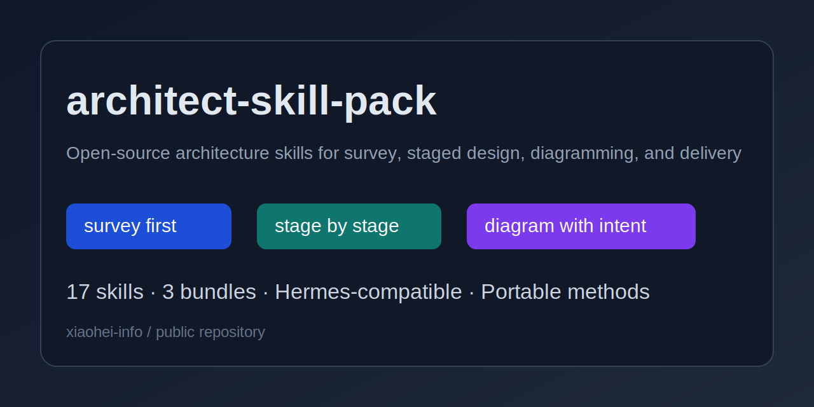

# architect-skill-pack

Languages: [English](README.md) | [简体中文](README.zh-CN.md)

**A reusable open-source skill pack for architecture work: survey, solution design, technical overview, detailed design, deployment handoff, and architecture-grade diagrams.**

Use this repository when your architect agent or architecture workflow has one of these failure modes:
- it jumps from vague demand straight into implementation
- architecture docs mix business framing, technical design, and deployment details into one blurry artifact
- diagrams exist, but each one answers the wrong question
- solution survey is shallow, so teams rebuild what mature systems already solved
- detailed design is incomplete, so implementation starts without clear flows, contracts, or verification paths

You can adopt **one skill**, **one bundle**, or the **full pack** depending on what your team is missing.



## What this pack contains

This repository packages 17 Hermes-compatible skills into three public bundles:

- **lifecycle-methodology** — stage routing and end-to-end architecture delivery discipline
- **diagramming** — business architecture, business flow, system architecture, technical architecture, and core-flow diagramming methods
- **architecture-supplements** — DDD boundary modeling, design-pattern/refactoring guidance, and technology adoption comparison

## Start small: one skill, one bundle, or the full pack

You do **not** need to install everything.

- **One skill** — fix one sharp architecture failure
  - Example: `lifecycle-methodology/arch-lifecycle-delivery`
- **One bundle** — improve one class of architecture work
  - Example: `diagramming/`
- **Full pack** — install the whole architecture workflow kit

## Good first picks by need

### If architecture work starts too early or in the wrong stage
Start with:
- `lifecycle-methodology/arch-lifecycle-delivery`
- `lifecycle-methodology/arch-lifecycle-demand-survey-methodology`

### If solution design is fuzzy
Start with:
- `lifecycle-methodology/arch-lifecycle-solution-design-methodology`
- `diagramming/arch-lifecycle-solution-design-biz-flow-diagramming`
- `diagramming/arch-lifecycle-solution-design-biz-arch-diagramming`

### If technical design is missing structure
Start with:
- `lifecycle-methodology/arch-lifecycle-tech-overview-methodology`
- `lifecycle-methodology/arch-lifecycle-tech-detailed-methodology`
- `diagramming/arch-lifecycle-tech-detailed-core-flow-diagramming`
- `diagramming/arch-lifecycle-tech-detailed-technical-arch-diagramming`

### If technology choices keep turning into opinion fights
Start with:
- `architecture-supplements/technology-adoption-comparison`
- `architecture-supplements/ddd-domain-modeling-for-architecture`
- `architecture-supplements/design-patterns-and-refactoring`

## Quick install for Hermes

### 1. Clone the repo

```bash
git clone https://github.com/xiaohei-info/architect-skill-pack.git
cd architect-skill-pack
```

### 2. Copy one skill into your Hermes skill library

Example: install `arch-lifecycle-delivery` only.

```bash
mkdir -p ~/.hermes/skills/software-development
cp -R skills/lifecycle-methodology/arch-lifecycle-delivery   ~/.hermes/skills/software-development/
```

### 3. Or copy one full bundle

Example: install the full lifecycle bundle.

```bash
mkdir -p ~/.hermes/skills/software-development
cp -R skills/lifecycle-methodology/* ~/.hermes/skills/software-development/
```

### 4. Preserve support files

Always copy the whole skill directory, not only `SKILL.md`.

That means preserving any bundled:
- `references/`
- `templates/`
- `scripts/`
- `assets/`

## Use it even if you are not on Hermes

These skills are packaged in Hermes-compatible format, but most of the core methods are portable.

Typical translations:
- `skill loading` -> your prompt/module/method loading mechanism
- `delegate_task` -> your child-agent or specialist-worker abstraction
- `read_file/search_files/patch/write_file` -> your codebase tooling
- `todo` -> your planner or execution state layer

See [`docs/portability-notes.md`](docs/portability-notes.md) before adapting the pack into another runtime.

## Repository layout

```text
skills/
  lifecycle-methodology/
  diagramming/
  architecture-supplements/

docs/
  adoption-guide.md
  bundles.md
  portability-notes.md
  social-preview.md
  source-map.md

assets/
  social-preview.svg
```

## Why this pack is different

The strongest ideas in this repo are:
- **survey before architecture** instead of jumping straight to custom design
- **stage-specific delivery** instead of one giant design blob
- **diagram responsibility discipline** instead of mixing every concern into one picture
- **implementation-ready detailed design** instead of elegant but unusable architecture prose
- **explicit trade-offs and verification** instead of architecture-by-confidence

## Recommended reading path

1. Pick the failure mode you want to fix.
2. Install one skill or one bundle.
3. Read [`docs/adoption-guide.md`](docs/adoption-guide.md) for rollout guidance.
4. Read [`docs/portability-notes.md`](docs/portability-notes.md) if you are adapting outside Hermes.
5. Read the chosen skill's `SKILL.md` and support files before relying on it in production.

## Related docs

- [`AGENTS.md`](AGENTS.md) — repository working rules for agent collaborators
- [`docs/adoption-guide.md`](docs/adoption-guide.md) — modular adoption paths and install guidance
- [`docs/bundles.md`](docs/bundles.md) — bundle-by-bundle overview
- [`docs/portability-notes.md`](docs/portability-notes.md) — what is Hermes-native vs portable
- [`docs/source-map.md`](docs/source-map.md) — public bundle to original source mapping
- [`CONTRIBUTING.md`](CONTRIBUTING.md) — contribution guidance
- [`SECURITY.md`](SECURITY.md) — responsible disclosure path
- [`CODE_OF_CONDUCT.md`](CODE_OF_CONDUCT.md) — participation expectations

## License

MIT
